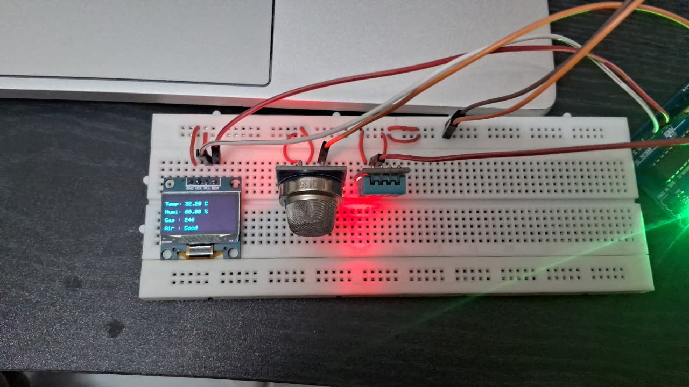
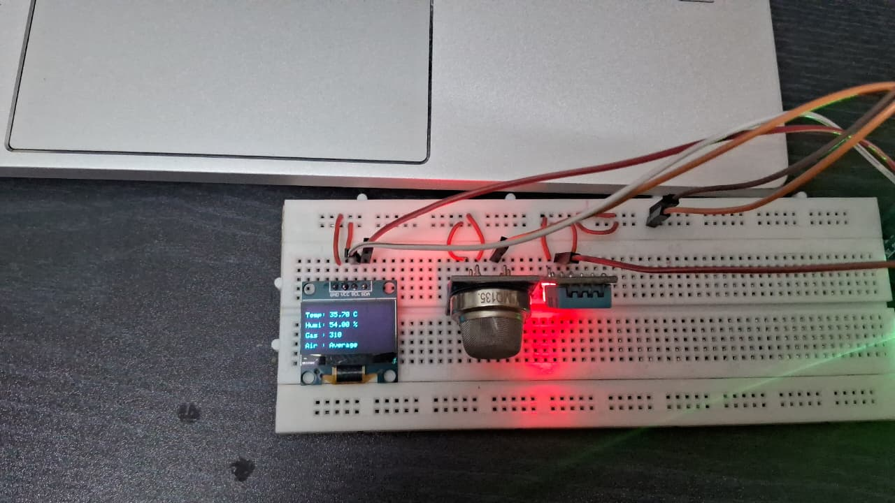
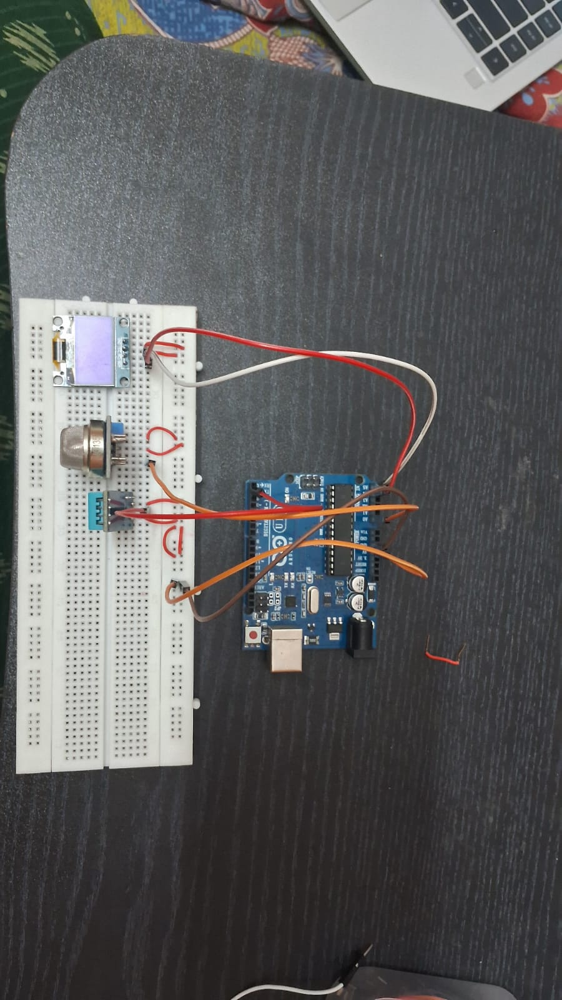

# Air Quality Monitoring System

## Overview

The Air Quality Monitoring System is an IoT-based project designed to monitor air pollution levels in real time using gas sensors and a microcontroller. The system helps detect harmful gases and promotes environmental awareness.

## Objectives

- Monitor air quality in real time.
- Detect harmful gases in the environment.
- Provide visual indication of air quality levels.
- Increase awareness about environmental pollution.

## Components Used

- Arduino Uno
- Gas Sensor (MQ Series)
- LEDs
- Breadboard
- Jumper Wires
- Power Supply

## Working Principle

The gas sensor continuously measures the concentration of pollutants in the surrounding air. The Arduino processes the sensor readings and categorizes air quality levels. Based on the readings, the system provides visual indications through LEDs.

## Features

- Real-time air quality monitoring
- Pollution level detection
- Visual status indication
- Low-cost implementation
- Easy to deploy

## Applications

- Homes
- Schools and Colleges
- Industrial Areas
- Environmental Monitoring

## Project Images

### Good Air Quality Indication

### Average Air Quality Indication

### Prototype Setup

## Future Enhancements

- Mobile application integration
- IoT cloud monitoring
- SMS/Email alerts
- Historical data analysis
- AI-based pollution prediction

## Technologies Used

- Arduino IDE
- Embedded C
- IoT Concepts

## Contributors

- Dhayas Sri R
- Abirami V
- Dibika A
- Atshaya K N
